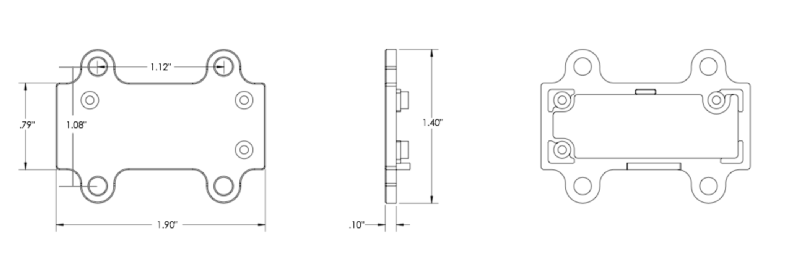
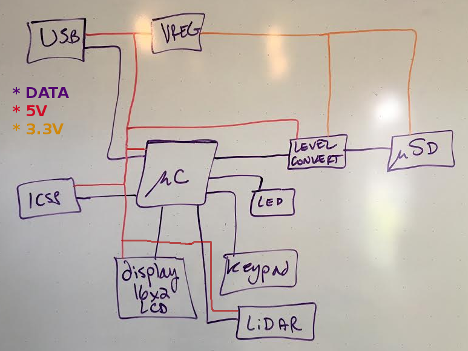

# LiDARLite-Hat
A simple datalogging hat for the LiDAR-Lite rangefinder from PulsedLight3D.

### Getting Started

The primary reference is the <a href="https://github.com/PulsedLight3D/LIDAR-Lite-Documentation/raw/master/Docs/LIDAR-Lite-v1-docs.pdf">LiDAR-Lite v1 Operating Manual</a>. 

The board and the rangefinder must be connected by a custom jumper. The length of the jumper must be as short as possible. The mating connector to the LiDAR-Lite is Molex P/N 5023800600 (Digikey P/N WM2271-ND).

The board must sit against the back of the unit. The board must be shaped according to page 12 of the manual. It may be double sided, in which case it must sit on spacers. 

The schematic and layout must be created in KiCad. The board must be licensed under CERN's Open Hardware License v1.2, and any test code must be licensed under the GPL v3. 

The LiDAR-Lite supports PWM and I2C communication; therefore, the microcontroller must support both methods of communication. 

The board must include the following:

- an Arduino-compatible microcontroller 
- a micro-USB connector 
- a micro-SD card for logging 
- all input/output pins exposed on breakout headers
- voltage regulation to provide 3.3V from the 5V USB input 
- heartbeat LED 
- 2x3 ICSP header broken out for programming bootloader

The board must be programmable directly from Arduino IDE over a USB cable.

EEPROM may be used on the microcontroller for persistent information.

### Block Diagram

I make a block diagram on my way to figuring out which microcontroller to use. 

### Setting up the KiCAD Project

Before choosing a template with design rules, I have to decide which board house to use, and I choose OSH Park. They charge $5/square inch (two-layer) or $10/square inch (four-layer) for a set of three boards. 

