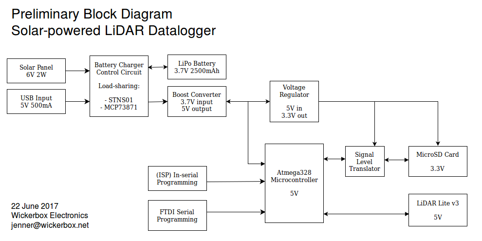

\begin{center}
\huge Off-the-shelf Prototype Cost Estimate
\end{center}

|Module|Vendor|Cost|
|------|------|----|
|6V Solar Panel|Adafruit|[$30](https://www.adafruit.com/product/200)|
|USB/DC/Solar LiPo Charger|Adafruit|[$17.50](https://www.adafruit.com/product/390)|
|Solar Panel Adapter Cable|Adafruit|[$1](https://www.adafruit.com/product/2788)|
|Arduino Uno|Adafruit|[$25](https://www.adafruit.com/product/50)|
|microSD Breakout Board|Adafruit|[$7.50](https://www.adafruit.com/product/254)|
|LiDAR-Lite v3|Sparkfun|[$150](https://www.sparkfun.com/products/14032)|

